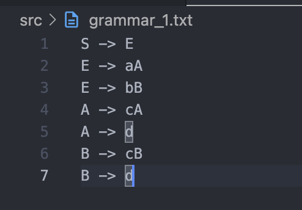
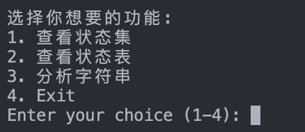
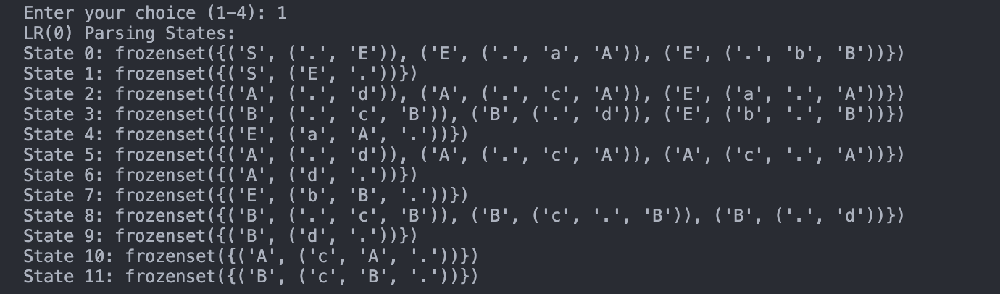
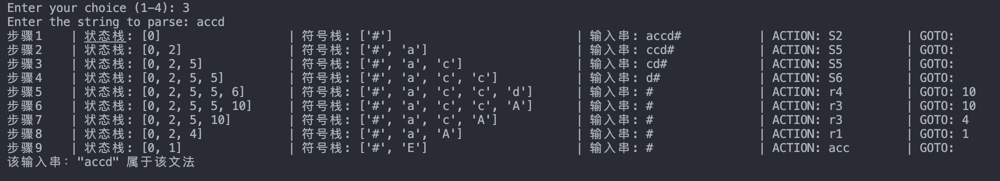
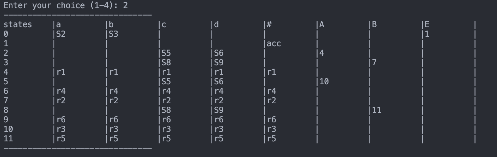

<!--
 * @Author: SheathedSharp z404878860@163.com
 * @Date: 2024-07-13 17:44:04
-->
# LR(0) Parser Implementation
This is a Python implementation of an LR(0) parser with a simple GUI interface. 
1. You do not need to install any external libraries. 
2. You can run the project by typing `python main.py` 
3. after running the project, you should select grammar1.txt in the `src` folder. 
4. You can also write your own grammar and use this project to perform LR(0) analysis on it.

> Wish you a happy use～
## Screenshots
Grammar1(Augmented Grammar) screenshot 

Main program page screenshot

View State Sets screenshot

View State Table screenshot

Analyze string

